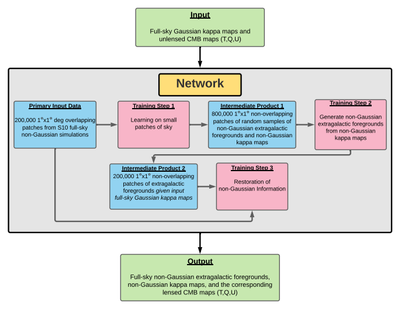
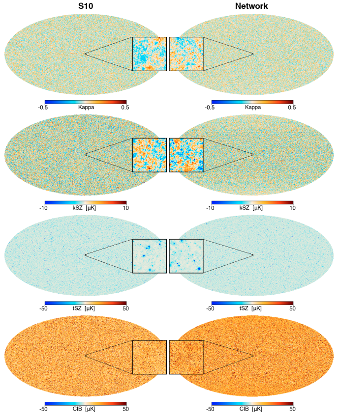

<!--
*** Thanks for checking out the Best-README-Template. If you have a suggestion
*** that would make this better, please fork the repo and create a pull request
*** or simply open an issue with the tag "enhancement".
*** Thanks again! Now go create something AMAZING! :D
***
***
***
*** To avoid retyping too much info. Do a search and replace for the following:
*** github_username, repo_name, twitter_handle, email, project_title, project_description
-->


<!-- PROJECT SHIELDS -->
<!--
*** I'm using markdown "reference style" links for readability.
*** Reference links are enclosed in brackets [ ] instead of parentheses ( ).
*** See the bottom of this document for the declaration of the reference variables
*** for contributors-url, forks-url, etc. This is an optional, concise syntax you may use.
*** https://www.markdownguide.org/basic-syntax/#reference-style-links
-->
[![Contributors][contributors-shield]][contributors-url]
[![Forks][forks-shield]][forks-url]
[![Stargazers][stars-shield]][stars-url]
[![Issues][issues-shield]][issues-url]
[![MIT License][license-shield]][license-url]
[![LinkedIn][linkedin-shield]][linkedin-url]


<!-- PROJECT LOGO -->
<br />
<p align="center">

  <h3 align="center">Cosmikyu</h3>

  <p align="center">
Cosmikyu is a software stack to generate full-sky extragalactic foreground simulations of the microwave sky. At its core, cosmikyu includes three separate Generative Adversarial Networks (GAN) for (1) data augmentation, (2) image-to-image translation, and (3) image enhancement. Furthermore, it implements utility functions to "touch up" the raw outputs from the GAN networks. Cosmikyu is used to generate results for Han et al. 2021 (https://arxiv.org/abs/2105.11444)
    <br />
    <a href="https://github.com/dwhan89/cosmikyu"><strong>Explore the docs »</strong></a>
    <br />
    <br />
    <a href="https://github.com/dwhan89/cosmikyu">View Demo</a>
    ·
    <a href="https://github.com/dwhan89/cosmikyu/issues">Report Bug</a>
    ·
    <a href="https://github.com/dwhan89/cosmikyu/issues">Request Feature</a>
  </p>
</p>


<!-- TABLE OF CONTENTS -->
<details open="open">
  <summary><h2 style="display: inline-block">Table of Contents</h2></summary>
  <ol>
    <li>
      <a href="#about-the-project">About The Project</a>
      <ul>
        <li><a href="#built-with">Built With</a></li>
      </ul>
    </li>
    <li>
      <a href="#getting-started">Getting Started</a>
      <ul>
        <li><a href="#prerequisites">Prerequisites</a></li>
        <li><a href="#installation">Installation</a></li>
      </ul>
    </li>
    <!-- <li><a href="#usage">Usage</a></li> -->
    <li><a href="#roadmap">Roadmap</a></li>
    <li><a href="#contributing">Contributing</a></li>
    <li><a href="#references">References</a></li>
    <li><a href="#license">License</a></li>
    <li><a href="#contact">Contact</a></li>
    <li><a href="#acknowledgements">Acknowledgements</a></li>
  </ol>
</details>


<!-- ABOUT THE PROJECT -->
## About The Project
<h3 align="center">Schematic of Overall Procedure</h3>
<p align="center">
    
</p>
<p>Shown is a schematic of the overall procedure to train MillimeterDL network and generate the output maps from the input data. The
network is represented by the shaded gray box in the center. Our procedure starts with the Primary Input Data consisting
of 200,000 1
 x 1
sq deg. overlapping patches cut out from <a ref=https://arxiv.org/abs/0908.0540>Sehgal et al. 2010 simulations</a>. The pink boxes represent the three major training
steps described in Section III of <a ref="https://arxiv.org/abs/2105.11444">Han et al. 2021</a> The blue boxes represent inputs into each training step. The dark grey arrows indicate the input
and output of each step. Once the network training is completed, we feed full-sky Gaussian kappa maps and unlensed CMB
maps (T, Q, U) into the network (top green box); given these inputs, the network generates the final output products (bottom
green box), which are full-sky millimeter-wave simulations including lensed T, Q, and U maps, non-Gaussian kappa maps, and
non-Gaussian extragalactic foregrounds correlated with the kappa map and each other.
</p>

<h3 align="center">Map Level Comparision</h3>
<p align="center">
    
</p>
<p>
 From top to bottom, shown are the lensing convergence (κ), the kinetic Sunyaev-Zel’dovich effect (kSZ), the thermal
Sunyaev-Zel’dovich effect (tSZ), and the Cosmic Infrared Background (CIB) maps at 148 GHz from the S10 simulations (left
column) and from the network (right column). A flux cut of 7 mJy at 148 GHz is applied to the CIB maps. Full-sky maps are
shown in the Mollweide projection in the background, while center panels show zoom-ins of 1 x 1 sq deg. patches. All maps have the
units of µK, except for the κ map which is dimensionless. Note that <a ref=https://arxiv.org/abs/0908.0540>Sehgal et al. 2010 simulations</a> are unique for only one octant of the sky;
on the other hand, the network simulations do not have any repeated tiles.
</p>

<!--[![Product Name Screen Shot][product-screenshot]](https://example.com)-->

### Built With

* [python3](https://www.python.org/)
* [pyTorch](https://pytorch.org/)
* [pixell](https://pixell.readthedocs.io/en/latest/)
* [astropy](https://www.astropy.org/)
* [numpy](https://numpy.org/)


<!-- GETTING STARTED -->
## Getting Started

To get a local copy up and running follow these simple steps.

### Prerequisites

This is an example of how to list things you need to use the software and how to install them.
* python modules
  ```sh
  pip install -r requirements.txt
  ```

### Installation

1. Clone the repo
   ```sh
   git clone https://github.com/dwhan89/cosmikyu.git
   ```
2. Install cosmikyu packages
   ```sh
   pip install .
   ```


<!-- USAGE EXAMPLES -->
<!--## Usage

Use this space to show useful examples of how a project can be used. Additional screenshots, code examples and demos work well in this space. You may also link to more resources.

_For more examples, please refer to the [Documentation](https://example.com)_
-->


<!-- ROADMAP -->
## Roadmap

See the [open issues](https://github.com/dwhan89/cosmikyu/issues) for a list of proposed features (and known issues).


<!-- CONTRIBUTING -->
## Contributing

Contributions are what make the open source community such an amazing place to be learn, inspire, and create. Any contributions you make are **greatly appreciated**.

1. Fork the Project
2. Create your Feature Branch (`git checkout -b feature/AmazingFeature`)
3. Commit your Changes (`git commit -m 'Add some AmazingFeature'`)
4. Push to the Branch (`git push origin feature/AmazingFeature`)
5. Open a Pull Request

<!-- References -->
## References


```bibtex
@ARTICLE{Han2021,
       author = {{Han}, Dongwon and {Sehgal}, Neelima and {Villaescusa-Navarro}, Francisco},
        title = "{Deep learning simulations of the microwave sky}",
      journal = {\prd},
     keywords = {Astrophysics - Cosmology and Nongalactic Astrophysics},
         year = 2021,
        month = dec,
       volume = {104},
       number = {12},
          eid = {123521},
        pages = {123521},
          doi = {10.1103/PhysRevD.104.123521},
archivePrefix = {arXiv},
       eprint = {2105.11444},
 primaryClass = {astro-ph.CO},
       adsurl = {https://ui.adsabs.harvard.edu/abs/2021PhRvD.104l3521H},
      adsnote = {Provided by the SAO/NASA Astrophysics Data System}
}
```

```bibtex
@ARTICLE{Sehgal2010,
       author = {{Sehgal}, Neelima and {Bode}, Paul and {Das}, Sudeep and {Hernandez-Monteagudo}, Carlos and {Huffenberger}, Kevin and {Lin}, Yen-Ting and {Ostriker}, Jeremiah P. and {Trac}, Hy},
        title = "{Simulations of the Microwave Sky}",
      journal = {\apj},
     keywords = {cosmic microwave background, galaxies: clusters: general, galaxies: general, intergalactic medium, large-scale structure of universe, methods: N-body simulations, Astrophysics - Cosmology and Nongalactic Astrophysics, Astrophysics - Instrumentation and Methods for Astrophysics},
         year = 2010,
        month = feb,
       volume = {709},
       number = {2},
        pages = {920-936},
          doi = {10.1088/0004-637X/709/2/920},
archivePrefix = {arXiv},
       eprint = {0908.0540},
 primaryClass = {astro-ph.CO},
       adsurl = {https://ui.adsabs.harvard.edu/abs/2010ApJ...709..920S},
      adsnote = {Provided by the SAO/NASA Astrophysics Data System}
}

```


<!-- LICENSE -->
## License

Distributed under the APATCH-2.0 License. See `LICENSE` for more information.


<!-- CONTACT -->
## Contact

Your Name - [@dwhan89](https://twitter.com/dwhan89)

Project Link: [https://github.com/dwhan89/cosmikyu](https://github.com/dwhan89/cosmikyu)


<!-- ACKNOWLEDGEMENTS -->
<!--## Acknowledgements

* []()
* []()
* []()

-->


<!-- MARKDOWN LINKS & IMAGES -->
<!-- https://www.markdownguide.org/basic-syntax/#reference-style-links -->
[contributors-shield]: https://img.shields.io/github/contributors/dwhan89/cosmikyu.svg?style=for-the-badge
[contributors-url]: https://github.com/dwhan89/cosmikyu/graphs/contributors
[forks-shield]: https://img.shields.io/github/forks/dwhan89/cosmikyu.svg?style=for-the-badge
[forks-url]: https://github.com/dwhan89/cosmikyu/network/members
[stars-shield]: https://img.shields.io/github/stars/dwhan89/cosmikyu.svg?style=for-the-badge
[stars-url]: https://github.com/dwhan89/cosmikyu/stargazers
[issues-shield]: https://img.shields.io/github/issues/dwhan89/cosmikyu.svg?style=for-the-badge
[issues-url]: https://github.com/dwhan89/cosmikyu/issues
[license-shield]: https://img.shields.io/github/license/dwhan89/cosmikyu.svg?style=for-the-badge
[license-url]: https://github.com/dwhan89/cosmikyu/blob/master/LICENSE.txt
[linkedin-shield]: https://img.shields.io/badge/-LinkedIn-black.svg?style=for-the-badge&logo=linkedin&colorB=555
[linkedin-url]: https://linkedin.com/in/dwhan89
